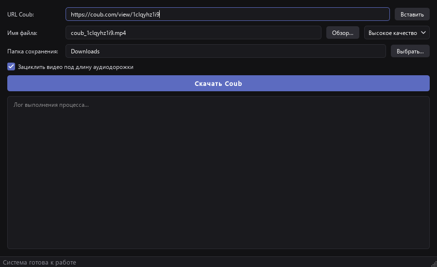

# Руководство Coub Downloader

[Главная страница](../README.md) · [Сборка и релизы](RELEASING.md)

## Скачивание

Вставьте ссылку `https://coub.com/view/ID` или буквенно-цифровой ID.
Допустимы ссылки с `www.coub.com`, завершающим `/` и параметрами запроса.
Ссылки других сайтов и страницы Coub вне `/view/ID` отклоняются.
Кнопка «Вставить» читает буфер обмена. При запуске ссылка Coub из буфера
может быть подставлена автоматически.

При вставке стандартной ссылки имя меняется на `coub_ID.mp4`.
Его можно изменить вручную. Указывайте только имя, без пути к папке;
расширение `.mp4` добавляется автоматически, если его нет.
Выбор через «Обзор...» обновляет и имя, и папку.
«Выбрать...» меняет только папку сохранения.

Системная папка загрузок определяется через Qt: Windows Known Folders / Linux XDG.
Если Qt не возвращает путь, используется `Downloads` внутри домашней папки.
Для выбранной папки необходимы права записи.

Высокое качество использует варианты `high` API Coub, среднее — `med`.
Если выбранный вариант отсутствует, загрузка завершается ошибкой;
автоматическое снижение качества не выполняется.

Зацикливание включено по умолчанию: видео повторяется до конца аудио.
При выключенном зацикливании результат ограничивается более короткой дорожкой,
если длительности доступны. Видео копируется без перекодирования,
аудио преобразуется в AAC. Результат сохраняется в MP4.

## Прогресс и сохранность файлов

Первые 40% — загрузка видео, следующие 40% — аудио, последние 20% — сборка.
При неизвестном размере ответа прогресс скачивания обновится после его окончания.
Если длительность дорожек не определилась, сборка может не показывать промежуточный процент.
100% отображается только после успешного сохранения результата.

Каждая задача создаёт отдельную временную папку внутри папки сохранения.
После завершения она удаляется. При ошибке прежний итоговый файл не заменяется;
успешная загрузка заменяет файл с тем же именем.
Одновременно в одном окне выполняется одна загрузка. После окончания можно скачать
следующий ролик. Закрытие окна во время работы блокируется; отмены загрузки нет.

## Если возникла ошибка

| Симптом | Что проверить |
| --- | --- |
| FFmpeg/ffprobe не запускается | При запуске исходников проверьте обе команды в PATH. Для бинарника скачайте полный файл заново и проверьте блокировку антивирусом. |
| Медиа не найдено | Ссылку, доступность ролика и выбранное качество. Попробуйте другой вариант качества. |
| Ошибка скачивания | Доступность Coub/CDN, сетевое соединение и ограничения сети. |
| Нет прав на запись | Выберите доступную папку и проверьте свободное место. |
| PyQt6 или requests не импортируется | Установите requirements.txt тем же Python, которым запускаете приложение. |
| Qt не запускается на Linux | Наличие графической сессии, библиотек Qt/XCB и совместимой glibc. |

Подробности обработки выводятся в журнале окна.
API Coub и CDN — внешние сервисы: их недоступность не устраняется переустановкой приложения.

Проверка готового бинарника описана в [RELEASING.md](RELEASING.md).
